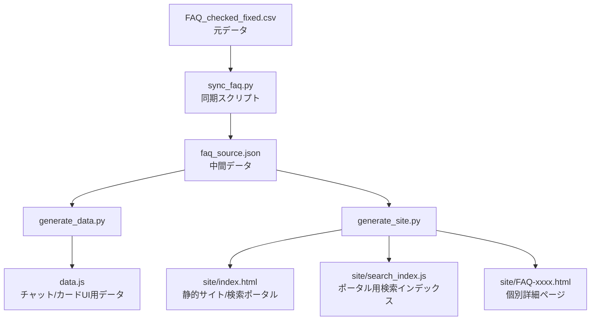

# FAQシステム メンテナンスガイド

本ドキュメントは、FAQコンテンツの更新やデザイン修正を行う作業者向けのマニュアルです。

## 1. システム構成図

データの流れは以下の通りです。基本的には **CSVを編集し、スクリプトを実行する** ことで全環境が更新されます。



---

## 2. FAQコンテンツの更新手順

### 手順 1: CSVファイルの編集
`FAQ_checked_fixed.csv` を Excel やテキストエディタで開きます。
- **追加・修正**: 行を追加、または既存のセルを修正します。
- **多言語対応 (NEW)**:
    - `カテゴリー_en`, `質問_en`, `回答_en` に英語の翻訳を入力します。
    - 空欄の場合は自動的に日本語がフォールバックとして使用されます。
- **人気項目の設定**: `is_popular` 列に `1` を入力すると、ポータルサイトの最上部に掲示されます。
- **タグの活用**: 「サービスタグ」や「カテゴリー」を適切に設定することで、サイト上の階層が自動構成されます。

### 手順 2: データの同期とサイト再生成
ターミナル（PowerShellなど）を開き、以下のコマンドを順番に実行します。

```powershell
# 1. CSVの内容をJSONに同期
python sync_faq.py

# 2. チャットUI用データ(data.js)の更新
python generate_data.py

# 3. ポータルサイト(site/)の再生成
python generate_site.py
```

### 手順 3: 動作確認
以下のファイルをブラウザで開き、変更が反映されているか確認します。
- **チャットUI**: `chat-style/index.html`
- **ポータルサイト**: `site/index.html`

---

## 3. デザイン・ブランド情報の変更

デザインの基本設定（テーマカラー、ロゴ等）は、各スクリプト内の定数を書き換えることで一括反映されます。

### テーマカラーの変更
`generate_site.py` の冒頭にある `BRAND_COLOR` 変数を修正します。
```python
BRAND_COLOR = "#5582af"  # ここを書き換えて再実行
```

### ロゴの変更
`brand_icon.svg` を上書き保存し、`generate_site.py` を再実行します。

---

## 4. 主要ファイルの説明

| ファイル名 | 役割 |
| :--- | :--- |
| `FAQ_checked_fixed.csv` | **最優先の元データ**。すべての文章・カテゴリ管理はここで行います。 |
| `sync_faq.py` | CSVからJSONへの変換を担います（重複チェック機能付き）。 |
| `generate_data.py` | チャット形式UIが読み込む `data.js` を自動生成します。 |
| `generate_site.py` | 検索・サジェスト機能付きの静的サイト（`site/`）を生成するエンジンです。 |
| `site/` フォルダ | 一般公開用のポータルサイト一式が含まれます。 |
| `chat-style/` フォルダ | LINE風チャットUIのフロントエンドコードです。 |

---

## 5. 技術仕様メモ

### 検索ロジック
- **ポータルサイト**: `search_index.js` を使用したクライアントサイド検索。
- **正規化**: 日本語のゆらぎ（ひらがな/カタカナ、英字の大文字/小文字）を正規化してマッチングします。
- **ハイライト**: 一致した文字列を `<span class="highlight">` で囲み表示します。

### 有人チャット連携
- FAQで解決しない場合に表示されるフォームから、氏名・会員IDを収集します。
- 生成されるURLには `?name=...&id=...&history=...` という形で情報が引き継がれ、オペレーター側で相談者の状況を確認できます。
